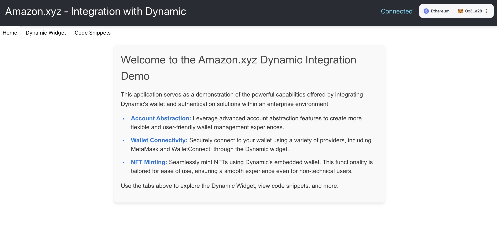

# Amazon-Dynamic Integration Demo App

Welcome to the Dynamic Integration Demo App for Amazon.xyz! This guide is designed to help you get started with integrating Dynamic's embedded wallet, minting NFTs, and addressing common challenges your team might face. Whether you're new to React/JS or exploring account abstraction for the first time, this README will guide you through the process.

### **Live Demo**

A live version of this app available! You can check it out here: [Live Demo App](https://dynamic-marcetux-cpfaadggdaaecfaw.westus-01.azurewebsites.net/). Feel free to explore and see the features in action, this application should also work as our sandbox to prototype potential solutions and provide examples on how to integrate with Dynamic.


## Getting Started

### Prerequisites

- **React/JS**: While your team may be more familiar with PHP, we've made sure this demo app is easy to follow. If you're new to React/JS, don't worry—just follow the comments in the code, and you'll be up and running in no time.
- **Node.js & npm**: Make sure you have Node.js and npm installed on your machine.

### Installation

1. **Clone the Repository**:
   ```bash
   git clone https://github.com/hectorMiranda/dynamic
   cd dynamic/dynamic-amazon-demo
   ```

2. **Install Dependencies**:
   ```bash
   npm install
   ```

3. **Run the App**:

   To run the app, you'll need to create a `.env` file in the root of your project directory with the following environment variables:

   ```bash
   REACT_APP_ENVIRONMENT_ID=your_environment_id_here
   REACT_APP_CONTRACT_ADDRESS=your_contract_address_here
   ```

   You can obtain your `REACT_APP_ENVIRONMENT_ID` by logging into your Dynamic dashboard at [https://app.dynamic.xyz/dashboard/developer/api](https://app.dynamic.xyz/dashboard/developer/api). Once logged in, navigate to the "API" section, where you will find your Environment ID. Copy this ID and paste it into your `.env` file.

   This Environment ID is crucial for connecting your app to the correct environment in Dynamic's ecosystem.

   After doing this, you should be able to run the app:

   ```bash
   npm start
   ```
   The app should now be running locally on `http://localhost:3000`.

## Features



### NFT Minting with Embedded Wallet

This demo walks you through integrating Dynamic's wallet and minting NFTs. Follow the steps in the [`Wallet integration`](dynamic-amazon-demo/src/components/WalletIntegration.js) file to see how the wallet is initialized, and refer to the [`NFTs minting`](docs/nft_minting.md) guide for examples on how to mint NFTs.

### Account Abstraction

The [`Account abstraction`](docs/account_abstraction.md) file explains the concept, its benefits, and how it ties into gas fees.

Account abstraction allows you to convert regular wallets into smart contract wallets, offering benefits like gas fee sponsorship, transaction bundling, and session keys. You can choose an account abstraction provider, and we’ve provided examples of how to set this up using Dynamic.

### Authentication: JWT vs. Cookies

Security is crucial, and we've noticed some concerns around cookie-based authentication. For this project, we recommend using JSON Web Tokens (JWT) instead. The [`jwtAuth.js`](dynamic-amazon-demo/src/auth/jwtAuth.js) file demonstrates how to issue, store, and validate JWTs. We also provide guidance on replacing cookie-based methods with JWT for enhanced security and scalability. More details can be found in the [`JWT Auth Guide`](docs/jwt_auth_guide.md).

If you prefer using cookies, Dynamic supports cookie-based authentication with secure, HttpOnly cookies across your subdomains. The setup requires custom domain configuration and specific DNS settings.

### Token Verification

To ensure secure communication with your backend, we've included examples of token verification in the [`tokenVerification.js`](dynamic-amazon-demo/src/auth/tokenVerification.js) file. This section shows how to pass and verify Dynamic’s token, with suggestions for using middleware to automate these checks. Refer to the [`Token Verification Guide`](docs/token_verification.md) for detailed instructions.

For JWTs, backend validation is straightforward using standard libraries, while for cookies, middleware can handle token verification seamlessly.

### React/JS Ecosystem

Since your team is new to React/JS, we've ensured that the code is extensively commented to guide you through the integration process. For additional support, check out the resources linked in the [`React Resources`](docs/react_resources.md) guide, and don't hesitate to reach out if you'd like a quick training session.

Dynamic provides extensive documentation and community support, and we’ve linked to these resources to help your team get up to speed quickly.

## Support and Collaboration

If you have any questions or run into issues, feel free to reach out to the Dynamic team. We're all on the same team and here to make sure your integration is successful.

## Next Steps

Start by exploring the [source code](dynamic-amazon-demo/src) and the accompanying [documentation](docs) to get a better understanding of how everything is structured. We recommend beginning with the [`WalletIntegration.js`](dynamic-amazon-demo/src/components/WalletIntegration.js) file to see how the embedded wallet is set up, and then reviewing the [`Account Abstraction documentation`](docs/account_abstraction.md) to understand how to implement advanced features.

If you encounter any roadblocks or have questions, don't hesitate to reach out—we're here to support you every step of the way. You can also find further guidance in the [`React/JS resources`](docs/react_resources.md) if your team needs to brush up on those skills.

We’re looking forward to your feedback and are committed to ensuring this integration goes as smoothly as possible.
