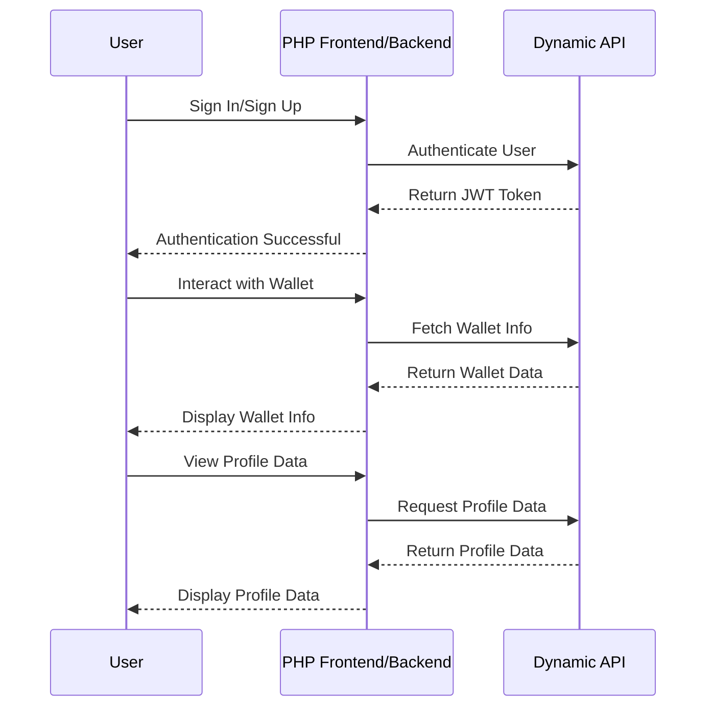

# Bridging the Gap: Using PHP as Frontend and Backend with Dynamic.xyz

This guide outlines how to integrate Dynamic.xyz into an application where PHP serves both as the frontend and backend, ensuring seamless interaction and integration of blockchain features.

## 1. Overview of Dynamic.xyz Integration

Dynamic.xyz provides tools for integrating blockchain features such as wallet management and authentication into your applications. With PHP handling both the frontend and backend, API interactions with Dynamic.xyz will all occur server-side, and the rendered HTML will be served directly to the user.

## 2. Handling User Authentication via Dynamic API

PHP will handle the user authentication by communicating with the Dynamic API. Here’s how you might implement this:

### **Authenticating Users via Dynamic API**

```php
<?php
// Example PHP code to authenticate users using Dynamic's API

$apiKey = "your_dynamic_api_key";
$endpoint = "https://api.dynamic.xyz/authenticate";

$data = [
    "email" => $_POST['email'],
    "password" => $_POST['password']
];

$options = [
    'http' => [
        'header'  => "Content-type: application/json
Authorization: Bearer $apiKey
",
        'method'  => 'POST',
        'content' => json_encode($data),
    ],
];

$context  = stream_context_create($options);
$result = file_get_contents($endpoint, false, $context);

if ($result === FALSE) {
    // Handle error
}

$response = json_decode($result, true);

if($response['status'] == 'success'){
    // Store JWT in session for further requests
    $_SESSION['jwt'] = $response['token'];
}
?>
```

### **Rendering Login Form in PHP**

```php
<form method="POST" action="login.php">
    <label for="email">Email:</label>
    <input type="email" id="email" name="email" required>
    
    <label for="password">Password:</label>
    <input type="password" id="password" name="password" required>
    
    <button type="submit">Sign In</button>
</form>
```

## 3. Fetching Data and Managing Wallets

Since PHP is handling the frontend, all interactions with Dynamic.xyz will be managed server-side. After a user is authenticated, their JWT can be used to make further API requests:

### **Fetching Wallet Data**

```php
<?php
// Example PHP code to fetch user wallet information using Dynamic's API

$jwtToken = $_SESSION['jwt'];
$apiKey = "your_dynamic_api_key";
$endpoint = "https://api.dynamic.xyz/wallets";

$options = [
    'http' => [
        'header'  => "Authorization: Bearer $jwtToken
X-API-Key: $apiKey
",
        'method'  => 'GET',
    ],
];

$context  = stream_context_create($options);
$result = file_get_contents($endpoint, false, $context);

if ($result === FALSE) {
    // Handle error
}

$walletInfo = json_decode($result, true);
?>

<div>
    <h2>Your Wallet</h2>
    <p>Address: <?php echo $walletInfo['address']; ?></p>
    <p>Balance: <?php echo $walletInfo['balance']; ?></p>
</div>
```

## 4. Handling Sessions and Authentication

Instead of using client-side storage like localStorage, PHP will handle user sessions on the server. This approach keeps JWTs and other sensitive data secure on the server:

### **Session Management in PHP**

```php
<?php
session_start();

// Example of storing JWT in session after login
$_SESSION['jwt'] = $response['token'];

// Example of clearing session on logout
session_destroy();
?>
```

## 5. Displaying Data with PHP

PHP will render all the necessary HTML directly, passing data from the backend to the frontend seamlessly:

### **Displaying Profile Data**

```php
<?php
// Example PHP code to fetch and display user profile data

$jwtToken = $_SESSION['jwt'];
$apiKey = "your_dynamic_api_key";
$endpoint = "https://api.dynamic.xyz/user-profile";

$options = [
    'http' => [
        'header'  => "Authorization: Bearer $jwtToken
X-API-Key: $apiKey
",
        'method'  => 'GET',
    ],
];

$context  = stream_context_create($options);
$result = file_get_contents($endpoint, false, $context);

if ($result === FALSE) {
    // Handle error
}

$userProfile = json_decode($result, true);
?>

<div>
    <h2>User Profile</h2>
    <p>Username: <?php echo $userProfile['username']; ?></p>
    <p>Email: <?php echo $userProfile['email']; ?></p>
</div>
```

## 6. Mermaid Sequence Diagram

Below is a sequence diagram illustrating the interactions between the user, PHP frontend/backend, and Dynamic API:



## Summary

By leveraging Dynamic’s API with PHP managing both the backend and frontend, you can build a robust, blockchain-integrated application entirely within the PHP ecosystem. This approach simplifies the development process and allows for tighter control over security and data handling.

